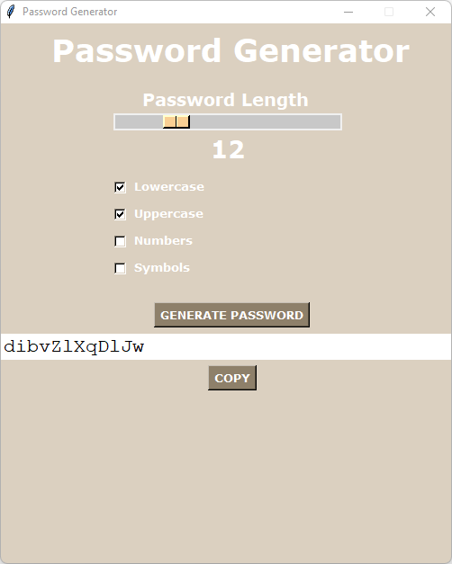
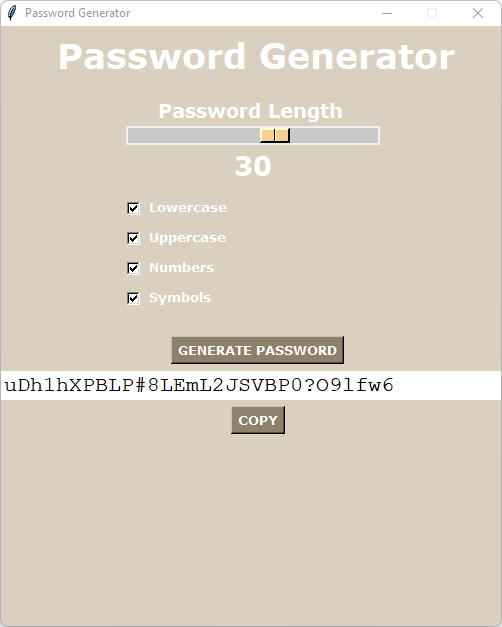
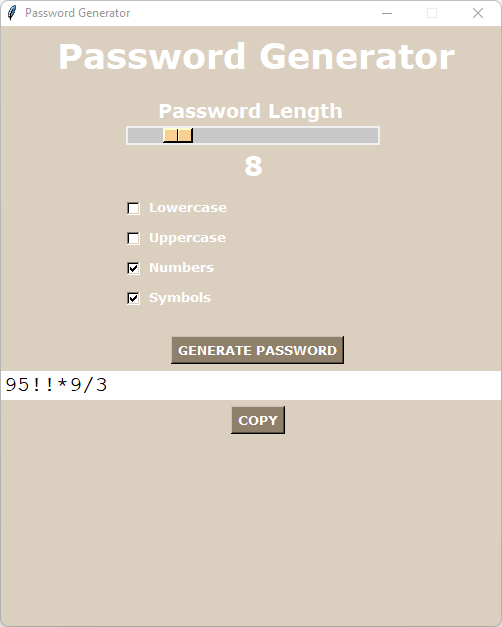

# password-generator
A simple password generator made with python. Includes a GUI made with tkinter. Comes with a runnable .exe file for windows.

# Screenshots

# Instructions
To run the .exe file, download as zip or clone the repository. The .exe file is within the project directory.

To run with python, download or clone the repository. Open terminal where the project directory is located. Run the command "pip install -r requirements.txt". Now run the "password_generator.py" file with python.
